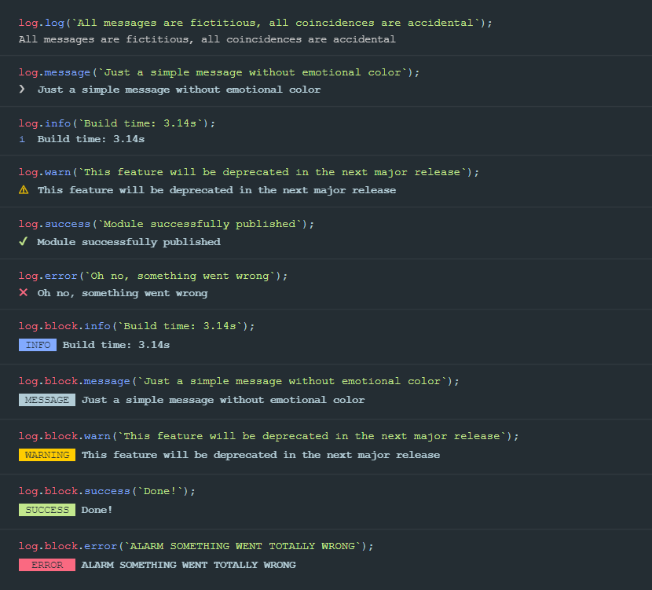

[](https://opensource.org/licenses/MIT)

# more-log

Stunningly dumb module for better terminal output.

## Installation

Using `npm`:

```bash
npm install @morev/more-log
```

Using `yarn`:

```bash
yarn add @morev/more-log
```

## Usage

ESM
```js
import log from '@morev/more-log';

log.success('Wow! It really works.')
```

CommonJS
```js
const log = require('@morev/more-log');

log.block.success('Also works this way');
```

## Examples of styled messages


